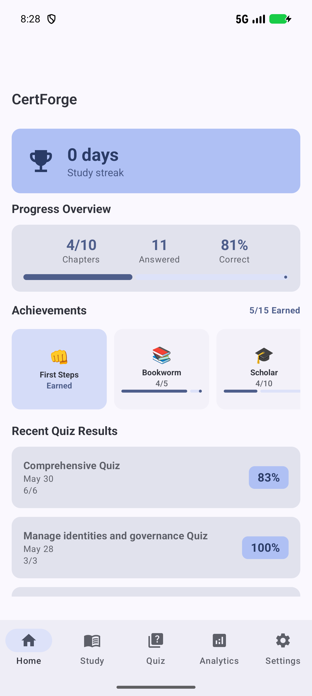
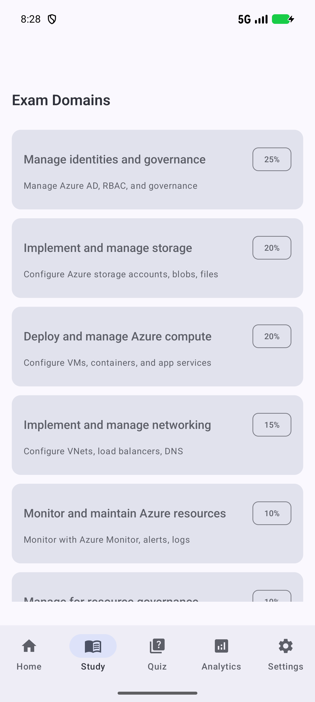
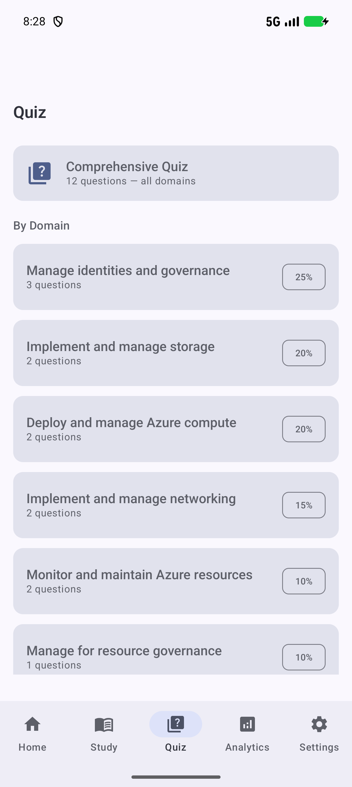
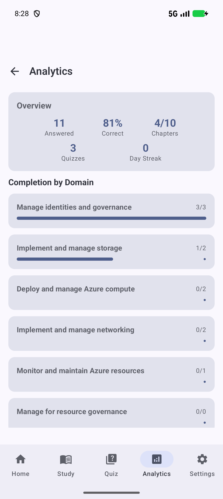
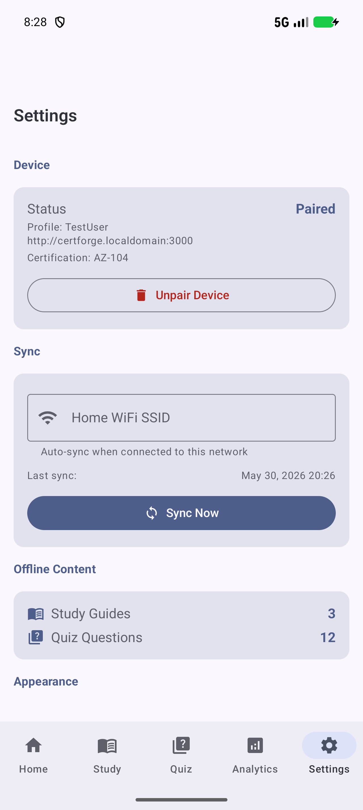

# CertForge

Native Android companion app for offline exam study with CertForge (multi-certification study platform, currently configured for AZ-104). Syncs progress bidirectionally with the CertForge web app over the home WiFi network.

## Features

- **Domain & chapter browser** — Browse exam domains and their chapters
- **Article viewer** — Full Microsoft Learn articles rendered in a WebView
- **Study guides** — AI-generated study guides with markdown rendering (tables, code blocks, lists)
- **Offline quiz engine** — Take domain-specific or comprehensive quizzes, scored locally
- **Progress tracking** — Mark chapters complete, track study streaks, view quiz history
- **Dashboard** — Overview of progress, achievements, and recent quiz results
- **Achievements** — 15 achievements with progress tracking
- **Bidirectional sync** — Sync progress with the web app over your home network
- **QR pairing** — Quick device pairing via QR code

## Tech Stack

| Layer | Technology |
|-------|-----------|
| Language | Kotlin |
| UI | Jetpack Compose + Material 3 |
| Database | Room (SQLite) |
| DI | Hilt |
| Navigation | Jetpack Navigation Compose |
| Network | Retrofit + OkHttp |
| Serialization | kotlinx-serialization |
| Background Sync | WorkManager |
| Security | EncryptedSharedPreferences |
| QR Scanning | CameraX + ML Kit Barcode Scanning |

## Architecture

```
UI (Jetpack Compose)
    ↕
Repository Layer (SyncRepository + ContentRepository)
    ↕
Room Database (SQLite — offline cache)
    ↔ HTTP sync ↔
Web App (Next.js → SQLite/SQL.js)
```

### Data Flow

- **Pairing** — Scan QR code → exchange setup token for API token
- **Sync** — Compare manifest hashes → download changes → upload local progress → download remote progress
- **Offline** — All reads from Room cache; writes queued for next sync
- **Quiz sessions** — Append-only, deduplicated by client-side UUID
- **Chapter progress** — Last-write-wins by timestamp

## Prerequisites

- Android Studio Ladybug (2024.2+) or JetBrains Fleet
- JDK 17+
- Android SDK 35
- An emulator or physical device running API 26+
- The CertForge web app running and accessible on the same network

## Building

```bash
# Debug APK
./gradlew assembleDebug

# Release APK
./gradlew assembleRelease

# Install on connected device
adb install -r app/build/outputs/apk/debug/app-debug.apk
```

The debug APK has the `.debug` suffix in the package name (debug = `com.certforge.app.debug`), allowing side-by-side installation with a release build.

> **Note:** The app was rebranded from "AZ-104 Study" to **CertForge**. The package was renamed from `com.az104.study` to `com.certforge.app`. If you had the old version installed, you'll need to re-pair — the app is treated as a new install.

## Project Structure

```
app/src/main/java/com/certforge/app/
├── data/
│   ├── local/
│   │   ├── dao/          # Room DAOs
│   │   └── entity/       # Room entities
│   ├── remote/
│   │   ├── SyncApi.kt    # Retrofit API interface
│   │   └── interceptor/  # OkHttp interceptors (auth, base URL)
│   └── repository/       # SyncRepository, ContentRepository
├── di/                   # Hilt modules
├── domain/
│   └── sync/             # Sync domain logic, worker
├── ui/
│   ├── navigation/       # NavGraph + route definitions
│   ├── screens/          # Feature screens
│   │   ├── achievements/
│   │   ├── analytics/
│   │   ├── articles/
│   │   ├── dashboard/
│   │   ├── domains/
│   │   ├── pairing/
│   │   ├── quiz/
│   │   ├── scanning/
│   │   ├── settings/
│   │   └── studyguides/
│   └── theme/            # Material 3 theming
└── util/                 # Preferences, token management
```

## Screenshots

| Home | Study | Quiz |
|------|-------|------|
|  |  |  |

| Analytics | Settings |
|-----------|----------|
|  |  |

### Screen Overview

| Screen | Description |
|--------|-------------|
| Dashboard | Streak, progress overview, achievements, recent quizzes, quick actions |
| Domains | List of exam domains with progress |
| Domain Chapters | Chapters within a domain with completion checkboxes |
| Article Viewer | Full Microsoft Learn article in WebView |
| Study Guide | AI-generated study guide with markdown rendering |
| Quiz Select | Choose domain or comprehensive quiz |
| Quiz Session | Take a timed quiz session |
| Quiz Results | Score breakdown and retry options |
| Quiz History | Past quiz sessions |
| Analytics | Performance analytics |
| Achievements | All achievements with progress tracking |
| Settings | Sync, offline content summary, theme preferences |
| Scan QR | Camera-based QR pairing |

## API Endpoints

The app communicates with the web app at the URL encoded in the pairing QR code. All endpoints require `Authorization: Bearer <apiToken>`. Sync endpoints accept `?certId=` query param (defaults to `"az-104"`).

| Method | Endpoint | Purpose |
|--------|----------|---------|
| GET | `/api/certifications` | List available certifications |
| POST | `/api/devices/pair` | Generate one-time setup token |
| POST | `/api/devices/confirm` | Exchange token for permanent API token |
| GET | `/api/sync/manifest[?certId=]` | Version hashes for all data types |
| GET | `/api/sync/domains[?certId=]` | All domains + chapters |
| GET | `/api/sync/questions[?since=&certId=]` | Practice questions |
| GET | `/api/sync/study-guides[?since=&certId=]` | AI study guides |
| GET | `/api/sync/articles[?certId=]` | Article metadata |
| GET | `/api/articles/{articleId}[?certId=]` | Full article HTML content |
| POST | `/api/sync/progress` | Upload quiz sessions + chapter progress |
| GET | `/api/sync/progress?profileId=[&since=]` | Download progress |

## License

MIT
